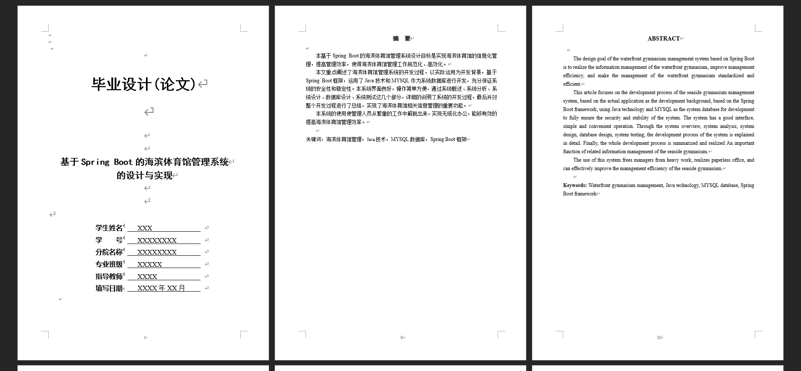
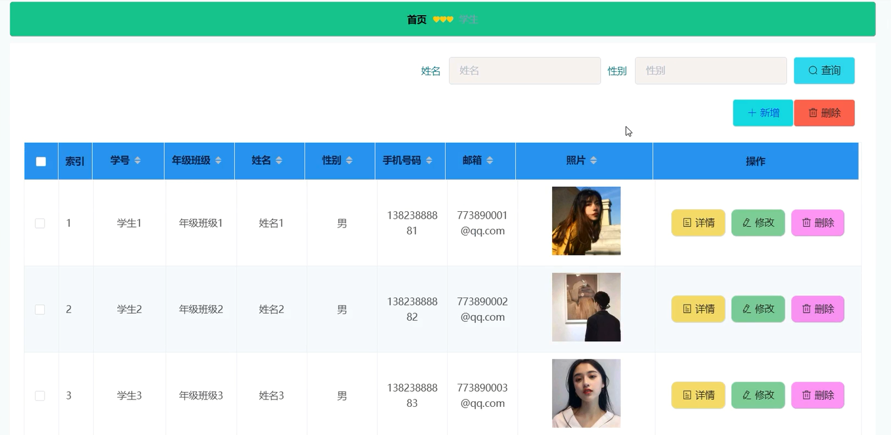
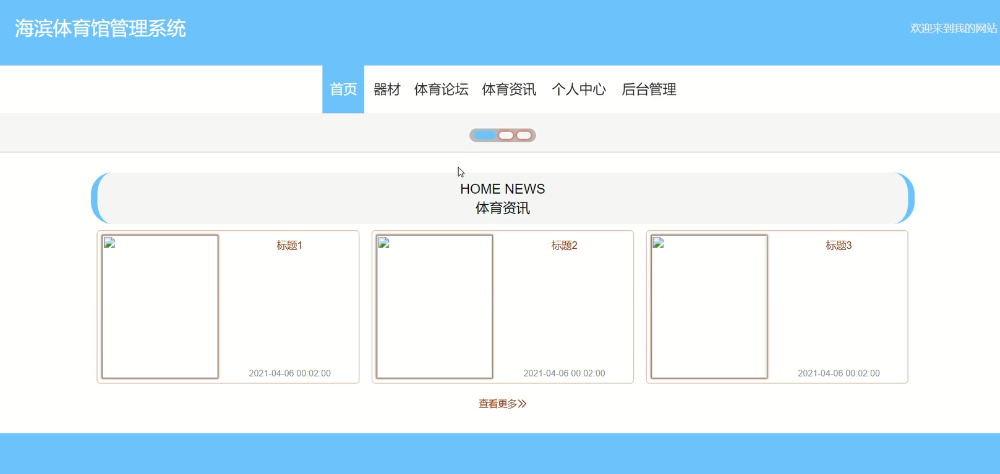
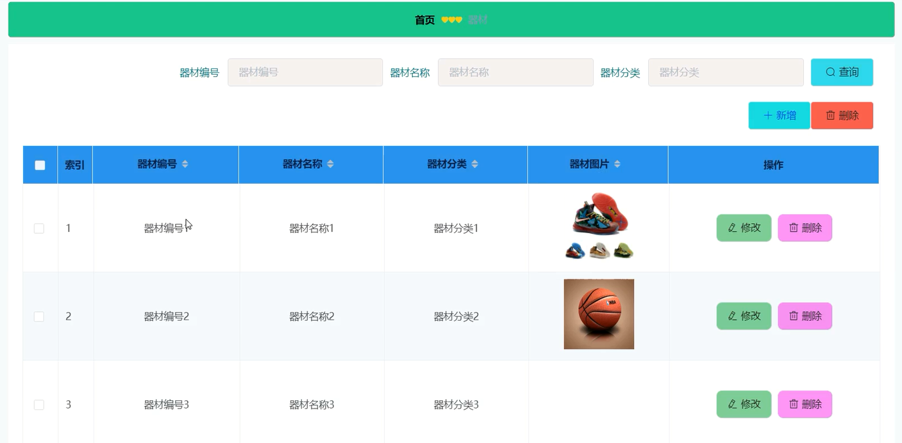
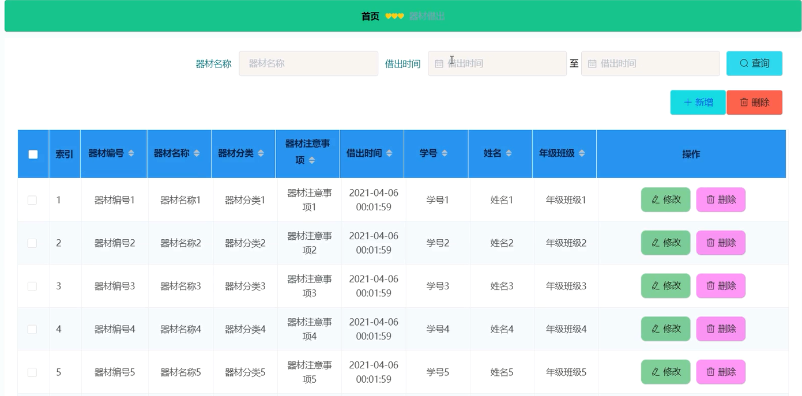
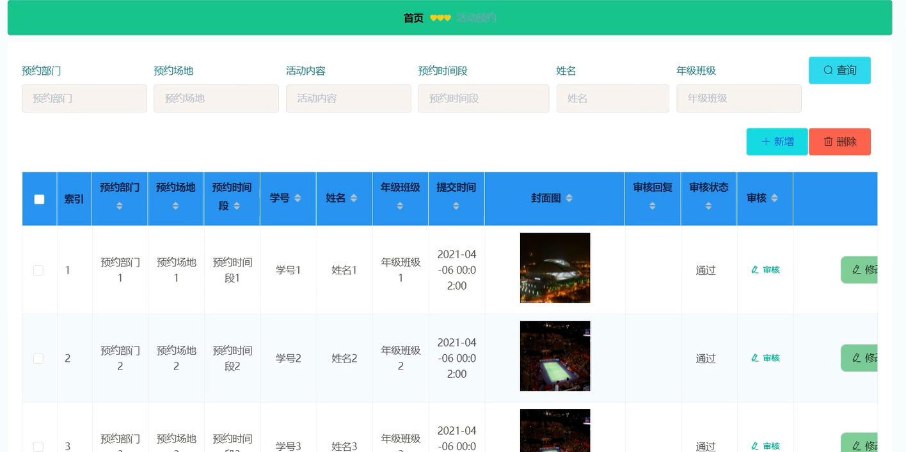

基于Springboot的海滨体育馆管理系统（程序+论文）
=
### 完整代码获取地址：从戎源码网 ([https://armycodes.com/](https://armycodes.com/))
### 作者微信：19941326836  QQ：952045282 
### 承接计算机毕业设计、Java毕业设计、Python毕业设计、深度学习、机器学习
### 选题+开题报告+任务书+程序定制+安装调试+论文+答辩ppt 一条龙服务
### 所有选题地址https://github.com/nature924/allProject

一、项目介绍
---
系统包含两种角色：用户、管理员，系统分为前台和后台两大模块，主要功能如下：
### 登录模块的实现
管理员和学生在登录界面输入用户名、密码，并选择用户类型进行登录操作。

### 注册模块的实现
没有账号的学生用户可进行注册操作。

### 学生管理模块的实现
管理员可以添加、修改和删除学生信息。

### 系统主界面模块的实现
学生可以进入系统前台查看系统信息，包括首页、器材信息以及体育论坛等。

### 器材管理模块的实现
管理员可以添加、修改和删除器材信息，学生可查看器材信息。

### 器材借出管理模块的实现
学生可以添加器材借出信息，管理员可以查看和管理所有器材借出信息，并可进行修改和删除操作。

### 活动预约管理模块的实现
学生可以添加活动预约信息，管理员可以查看活动预约信息，并可进行审核、修改和删除操作。

二、项目技术
---
- 编程语言：Java
- 数据库：MySQL
- 项目管理工具：Maven
- 前端技术：VUE、HTML、Jquery、Bootstrap
- 后端技术：Spring、SpringMVC、MyBatis

三、运行环境
---
- 操作系统：Windows、macOS都可以
- JDK版本：JDK1.8以上都可以
- 开发工具：IDEA、Ecplise、Myecplise都可以
- 数据库: MySQL5.7以上都可以
- Tomcat：任意版本都可以
- Maven：任意版本都可以

四、运行截图
---
### 论文截图：

### 程序截图：

